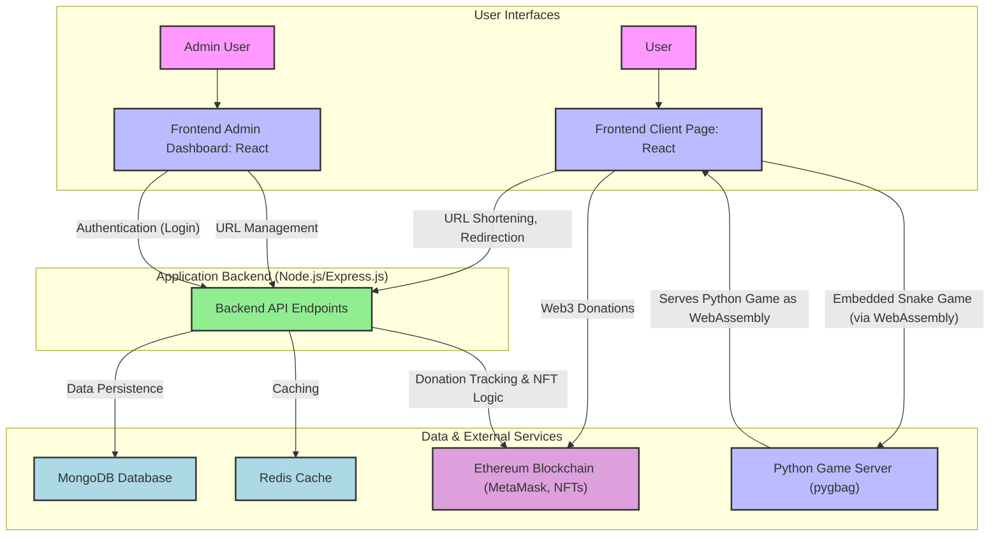

# URL Shortener with Web3 Donations & Embedded Snake Game

## 🎯 Project Abstract

A full-stack URL shortener application that converts long URLs into short, shareable links with integrated Web3 donation functionality and an embedded Python Snake game. The backend uses Node.js with Express for API services and MongoDB for data persistence, while Redis provides caching for improved performance. The frontend is built with React and TypeScript for reusable components and type safety. Web3 integration enables ETH donations with NFT rewards for contributors. The embedded Snake game runs via WebAssembly using pygbag.



## 🔗 Backend API Endpoints

### URL Management
- `POST /shorten` - Create shortened URL from long URL
- `GET /:shortCode` - Redirect to original URL using short code
- `GET /health` - Health check endpoint

### Authentication
- `POST /auth/register` - Register new user account
- `POST /auth/login` - User login authentication

### Admin Operations
- `GET /admin/urls` - Retrieve all URLs with pagination and sorting
- `PUT /admin/urls/:id` - Update existing URL short code
- `DELETE /admin/urls/:id` - Delete URL entry
- `GET /admin/updates` - Server-Sent Events endpoint for real-time updates

### Donation Tracking
- `POST /donation/track` - Track completed donation transactions
- `GET /donation/status/:txHash` - Check transaction status
- `GET /donation/history/:address` - Get donation history for wallet address

## 💻 Frontend Functions

### Client Features
- **URL Shortening**: Input long URLs and receive shortened versions
- **Service Status**: Real-time health monitoring with visual indicators
- **Copy to Clipboard**: Quick copy functionality for shortened URLs
- **Web3 Donations**: Connect MetaMask wallet and donate ETH
- **NFT Rewards**: Receive NFTs for donations ≥ $100 USD
- **Real-time USD Conversion**: View ETH amounts in USD equivalent
- **Embedded Snake Game**: Play Python Snake game directly in browser
- **Persistent Gaming**: Game stays loaded without reloading after modal close

### Admin Features
- **Dashboard Access**: Secure login for administrators
- **Real-time Updates**: Live status indicator with Server-Sent Events (SSE)
- **URL Management**: View, edit, and delete all shortened URLs
- **Sorting & Pagination**: Sort by URL, access count, or creation date
- **Live Analytics**: Real-time URL access count updates
- **Web3 Integration**: Withdraw donations directly from admin panel

## 🚀 Development

### Prerequisites
- Node.js (v20+, preferably v22.12+)
- Python 3.8+ (for Snake game)
- MongoDB (local or cloud instance)
- Redis (optional, for caching)
- MetaMask browser extension (for Web3 features)

### Setup Instructions

1. **Clone the repository**
   ```bash
   git clone <repository-url>
   cd URL-shortener
   ```

2. **Backend Setup**
   ```bash
   cd backend
   npm run setup
   ```
   This command will:
   - Install dependencies
   - Create .env from .env.example
   - Setup MongoDB database
   - Create demo admin user (username: admin, password: Admin123)
   - Generate example URLs
   - Run unit tests

3. **Frontend Setup**
   ```bash
   cd frontend
   npm run setup
   ```
   This will install dependencies and create environment configuration.

4. **Python Game Setup**
   ```bash
   cd game
   
   # Install Python dependencies and start the Snake game server (runs on port 8000)
   # Option 1: Use batch file (Windows)
   start_game.bat
   
   # Option 2: Direct command
   pip install -r requirements.txt
   python run_game.py
   ```

5. **Environment Configuration**
   - Backend: Update `backend/.env` with your MongoDB URI and other settings
   - Frontend: Update `frontend/.env` with API base URL

6. **Start Development Servers**
   ```bash
   # Backend (runs on port 8828)
   cd backend
   npm run dev
   
   # Frontend (runs on port 5173)
   cd frontend
   npm run dev
   ```

7. **Access the Application**
   - Client Interface: http://localhost:5173
   - Admin Dashboard: http://localhost:5173/admin
   - Snake Game: http://localhost:8000 (or embedded in client)
   - API Health Check: http://localhost:8828/health

## 🎮 Snake Game Features

- **Web-Compatible**: Python game converted to WebAssembly
- **Embedded Play**: Runs directly in the URL shortener interface
- **Instant Loading**: Game preloads and stays cached
- **Classic Gameplay**: Arrow keys/WASD controls, grow by eating food
- **Persistent State**: Game remains loaded when minimized

### Testing
```bash
# Backend tests
cd backend
npm test

# Load testing
npm run load-test
npm run stress-test
```

### Production Deployment
```bash
# Backend
cd backend
npm start

# Frontend
cd frontend
npm run build
npm run preview
```